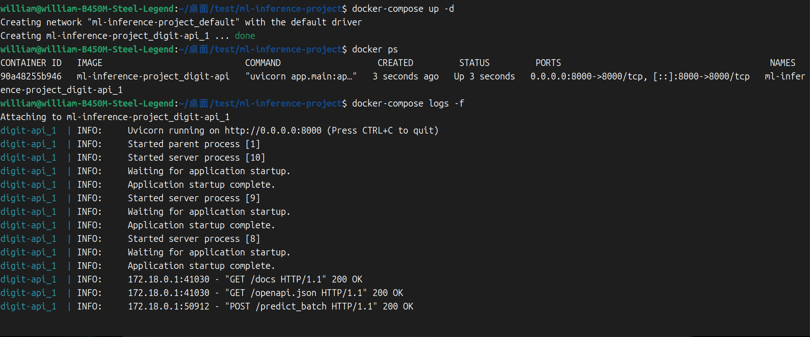
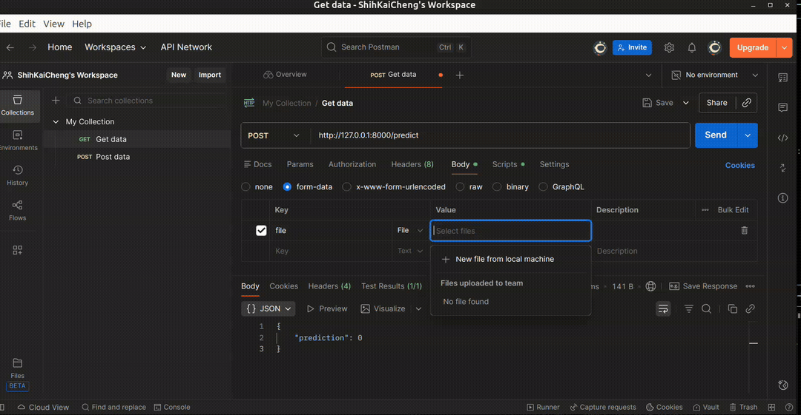

# Digit Recognition API

這是一個手寫數字識別後端 API，基於 **PyTorch + FastAPI** 開發。  
專案背景：這是我的一次線上復試上機測驗專案，雖然原始限制只有 2 小時，但作為自學者，我希望能完整完成，增加自己的能力與經驗。即便復試結果未必理想，也希望留下完整可用的作品。

---

## 專案功能

* **單張圖片數字預測** (`/predict`)
* **批次圖片數字預測** (`/predict_batch`)

  * 支援同時上傳多張圖片
  * 支援 ZIP 壓縮檔（可包含資料夾，只解析圖片）

模型採用 **CNN + Transformer** 架構，輸入 28x28 灰階圖片，輸出數字 0~9 的預測結果。

---

## API 說明

### 1️⃣ 單張圖片預測 `/predict`

* **方法：** `POST`
* **Content-Type:** `multipart/form-data`
* **欄位名稱:** `file`（上傳 PNG / JPG / JPEG 圖片）

**回傳範例：**

```json
{
    "prediction": 7
}
```

**錯誤範例：**

```json
{
    "error": "File is not an image: filename.png"
}
```

> ⚠️ 注意：
> - 返回值為預測數字，範圍 0~9。

---

### 2️⃣ 批次圖片預測 `/predict_batch`

* **方法：** `POST`
* **Content-Type:** `multipart/form-data`
* **欄位名稱:** `files`（可上傳單張圖片、多張圖片，或 ZIP 壓縮檔，僅包含圖片）

**回傳範例：**

```json
{
  "predictions": {
    "img_0_label_6.png": 6,
    "img_1_label_5.png": 5,
    "img_2_label_3.png": 3
  }
}
```

**錯誤範例：**

```json
{
  "error": "Zip contains non-image file: file_name"
}
```

**注意事項：**

* ZIP 壓縮檔中的資料夾會自動解析，只處理圖片
* 目前僅支援 PNG / JPG / JPEG 格式
* 非圖片檔案會回傳錯誤
* 單張圖片與批次圖片 API 回傳結構不同，請留意

---

## 專案結構

```
ml-inference-project/
├── app/
│   ├── __init__.py
│   ├── main.py
│   └── model.py
├── Dockerfile
├── docker-compose.yml
├── requirements.txt       # 安裝套件
├── model_weights.pth
├── README.md
├── test/                  # 測試圖片資料夾
├── ts_png/                # 測試支援多線程併發推論的圖片資料夾
├── docs_assets/           # 放 readme 使用的圖片 / GIF
├── test_inference.py      # 一開始測試模型用的
├── batch_predict.py       # 批次預測並將結果保存為 ./result.csv
├── batch_test.py          # 高頻 POST 測試多線程推論
└── augment_test_files.py  # 批量產生不同檔名測試圖片
```

---

## 在線測試

部屬完成後，可直接透過以下網址測試 API 功能：

[API Docs](https://<YOUR_RENDER_URL>/docs)

---

## 使用示意

### 1️⃣ Docker 映像檔與容器

* 建制映像檔：


* 啟動容器並查看 log：


### 2️⃣ Postman 測試

以下為單張圖片測試流程及回傳結果：


---

## 專案說明

此專案為我的自學練習及復試測驗作品，目的是展示手寫數字識別 API 的完整流程，包括單張與批次圖片預測、ZIP 壓縮檔處理，以及整合 FastAPI 服務。即便測驗未錄取，我仍希望透過完整實作來增強自己的能力。

> ⚠️ 注意：
> - 這個專案主要為測試與練習用途，因此沒有特別處理 `.env` 環境參數或忽略檔案（如 `.gitignore`）。
> - 專案內容是整包上傳，包括模型權重 (`model_weights.pth`)、測試圖片資料夾 (`test/`)、多線程測試圖片 (`ts_png/`) 等。
> - 使用者若自行部屬，需注意安全性與私密資訊設定。